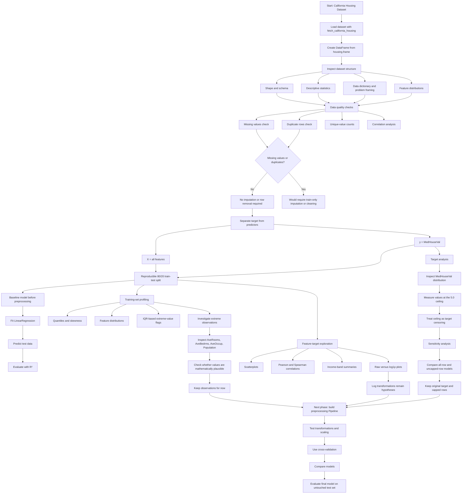

# California Housing Preprocessing Flow

```mermaid
flowchart TD
    A["Start: California Housing Dataset"] --> B["Load dataset with fetch_california_housing"]
    B --> C["Create DataFrame from housing.frame"]
    C --> D["Inspect dataset structure"]

    D --> D1["Shape and schema"]
    D --> D2["Descriptive statistics"]
    D --> D3["Data dictionary and problem framing"]
    D --> D4["Feature distributions"]

    D1 --> E["Data quality checks"]
    D2 --> E
    D3 --> E
    D4 --> E

    E --> E1["Missing values check"]
    E --> E2["Duplicate rows check"]
    E --> E3["Unique-value counts"]
    E --> E4["Correlation analysis"]

    E1 --> F{"Missing values or duplicates?"}
    E2 --> F

    F -->|"No"| G["No imputation or row removal required"]
    F -->|"Yes"| G2["Would require train-only imputation or cleaning"]

    G --> H["Separate target from predictors"]
    H --> H1["X = all features"]
    H --> H2["y = MedHouseVal"]

    H1 --> I["Reproducible 80/20 train-test split"]
    H2 --> I

    I --> J["Baseline model before preprocessing"]
    J --> J1["Fit LinearRegression"]
    J1 --> J2["Predict test data"]
    J2 --> J3["Evaluate with R²"]

    I --> K["Training-set profiling"]
    K --> K1["Quantiles and skewness"]
    K --> K2["Feature distributions"]
    K --> K3["IQR-based extreme-value flags"]

    K --> L["Investigate extreme observations"]
    L --> L1["Inspect AveRooms, AveBedrms, AveOccup, Population"]
    L1 --> L2["Check whether values are mathematically plausible"]

    L2 --> M["Keep observations for now"]

    H2 --> N["Target analysis"]
    N --> N1["Inspect MedHouseVal distribution"]
    N1 --> N2["Measure values at the 5.0 ceiling"]
    N2 --> N3["Treat ceiling as target censoring"]

    N3 --> O["Sensitivity analysis"]
    O --> O1["Compare all-row and uncapped-row models"]
    O1 --> O2["Keep original target and capped rows"]

    I --> P["Feature-target exploration"]
    P --> P1["Scatterplots"]
    P --> P2["Pearson and Spearman correlations"]
    P --> P3["Income-band summaries"]
    P --> P4["Raw versus log1p plots"]

    P4 --> Q["Log transformations remain hypotheses"]

    M --> R["Next phase: build preprocessing Pipeline"]
    O2 --> R
    Q --> R

    R --> R1["Test transformations and scaling"]
    R1 --> R2["Use cross-validation"]
    R2 --> R3["Compare models"]
    R3 --> R4["Evaluate final model on untouched test set"]
```